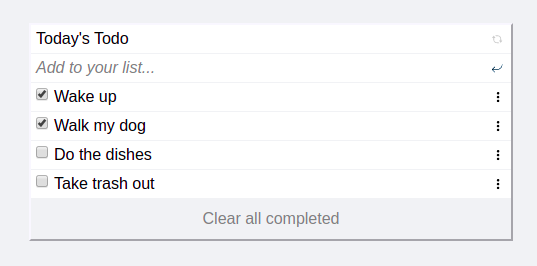

# Curriculum App Example Todo List

> A simple HTML list of To Do tasks

This simple web page was built using webpack and served by a webpack dev server

## Built With

- JavaScript
- HTML & CSS
- JSON
- Webpack

## Getting Started

To get a local copy up and running follow these simple example steps

### Setup

- run `npm install` in a terminal at the project's root directory
- open *index.html* from the dist directory in the browser

### Edit

- change only the files located *src* directory
- run `npm run build` in a terminal at the project's root directory to update the files in the dist directory
- to preview changes live use `npm start` in a terminal at the project's root directory

## Author

👤 **Maria Queme**

- GitHub: [@euqueme](https://github.com/euqueme)
- Twitter: [@marukk](https://twitter.com/marukk)
- LinkedIn: [LinkedIn](https://www.linkedin.com/in/maria-queme)

## 🤝 Contributing

Contributions, issues, and feature requests are welcome!

Feel free to check the [issues page](../../issues/)

## Show your support

Give a ⭐️ if you like this project!

## Acknowledgments

- Hat tip to anyone whose code was used
- Microverse
- Stackoverflow

## 📝 License

This project is [MIT](./MIT.md) licensed